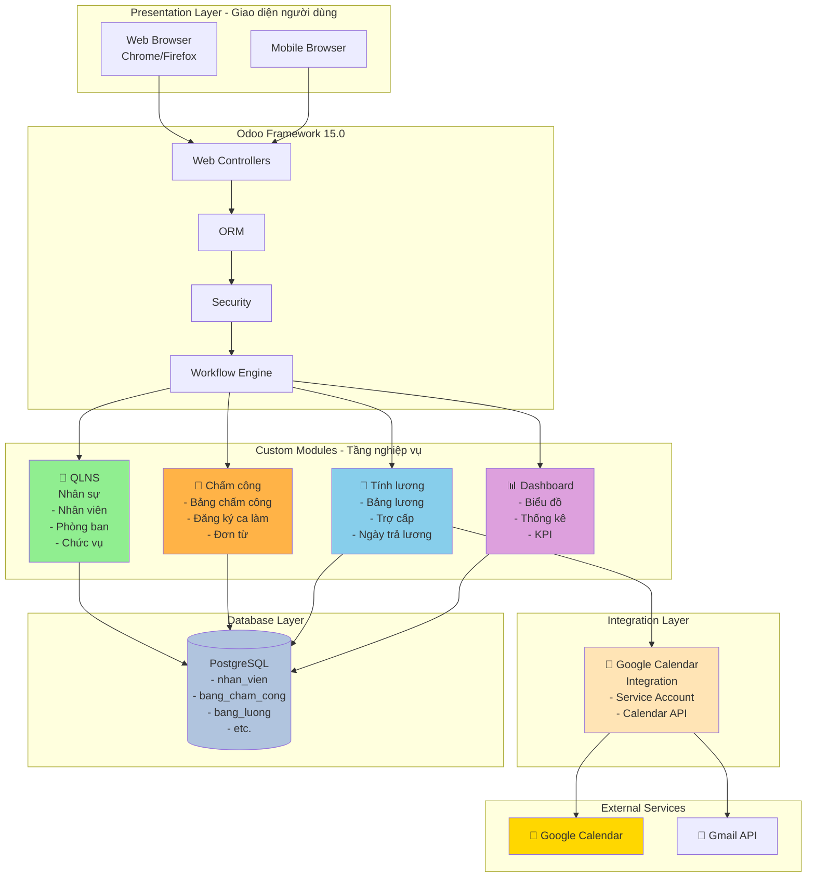
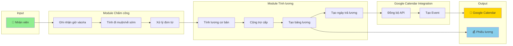
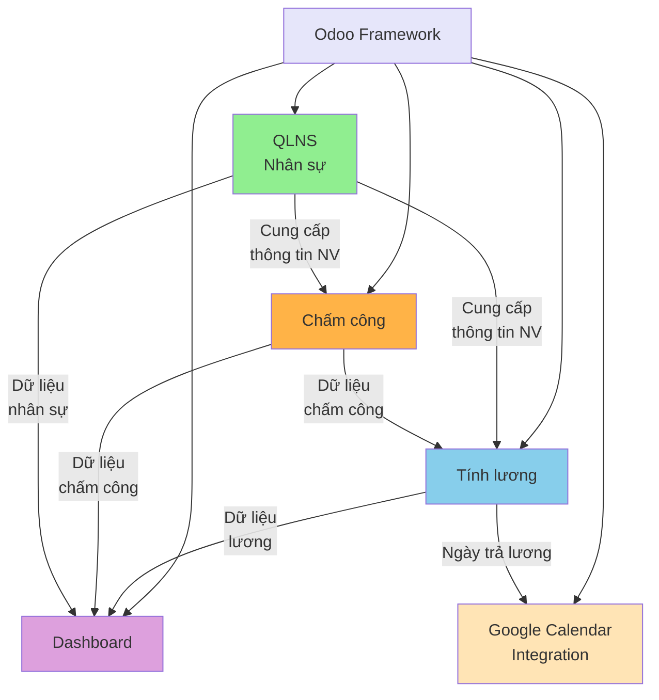
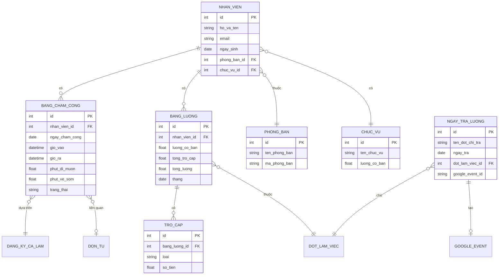
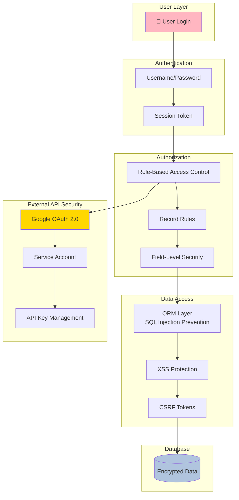
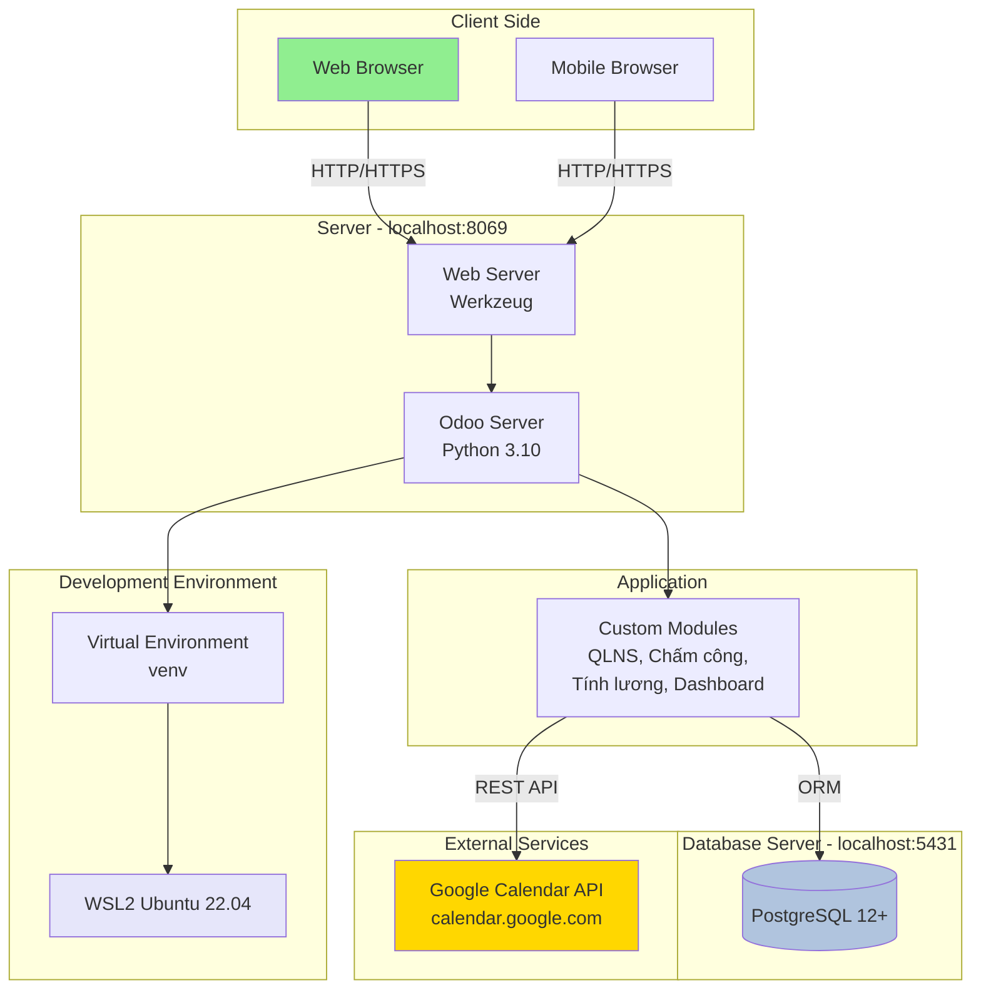
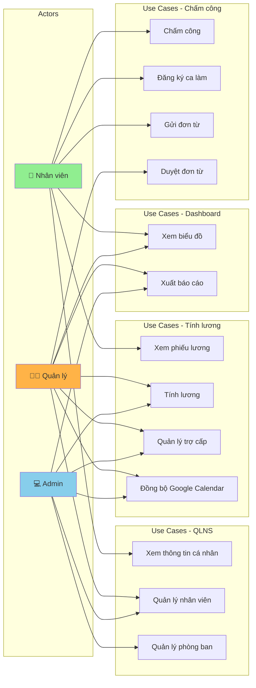
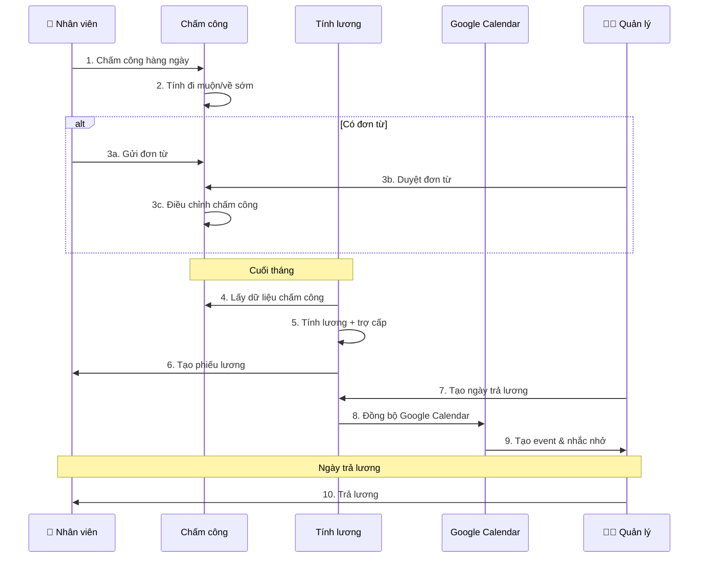
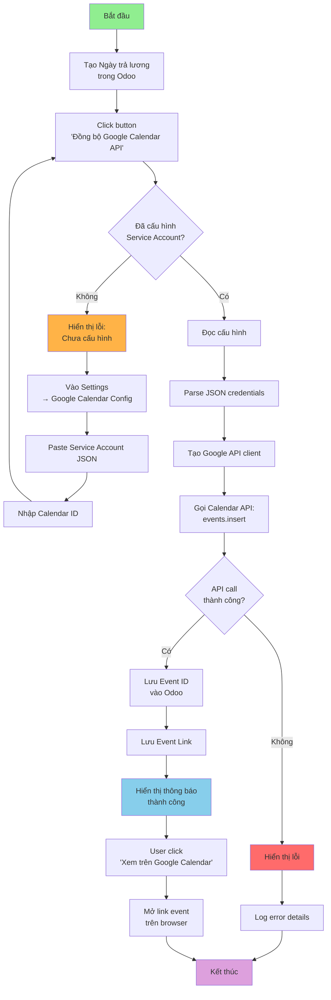
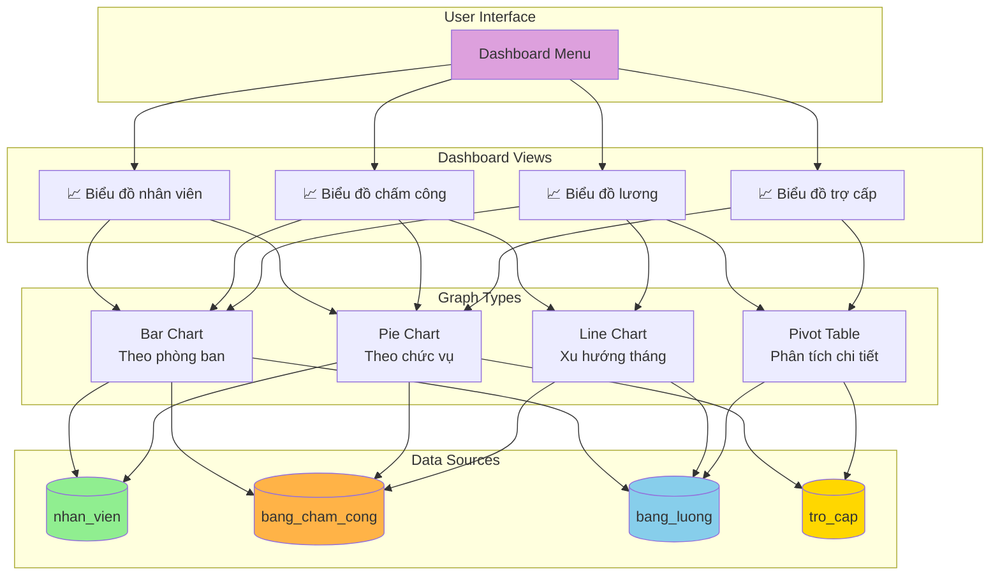

# 📐 SƠ ĐỒ KIẾN TRÚC HỆ THỐNG - MERMAID DIAGRAMS

## 1. 🏗️ Sơ đồ kiến trúc tổng thể (Architecture Diagram)

---

## 2. 🔄 Sơ đồ luồng dữ liệu (Data Flow Diagram)

---

## 3. 📊 Sơ đồ quan hệ Module (Module Relationship)

---

## 4. 🗄️ Sơ đồ cơ sở dữ liệu (ERD - Entity Relationship Diagram)

---

## 5. 🔐 Sơ đồ bảo mật (Security Architecture)

---

## 6. 🚀 Sơ đồ triển khai (Deployment Diagram)

---

## 7. 📈 Sơ đồ Use Case (Use Case Diagram)

---

## 8. ⚙️ Sơ đồ quy trình nghiệp vụ (Business Process Flow)

---

## 9. 🔗 Sơ đồ tích hợp Google Calendar (Integration Flow)

---

## 10. 📊 Sơ đồ Dashboard Architecture

---

## 📝 Cách sử dụng

### Xem trên GitHub/GitLab:
- Các sơ đồ Mermaid sẽ tự động render

### Xem trên VS Code:
1. Cài extension: "Markdown Preview Mermaid Support"
2. Mở file này
3. Nhấn `Ctrl+Shift+V` để preview

### Xuất ra hình ảnh:
- Sử dụng https://mermaid.live
- Copy code Mermaid
- Export PNG/SVG

### Chỉnh sửa:
- Thay đổi text trong `[]` hoặc `{}`
- Thêm/bớt node bằng cách thêm/xóa dòng
- Thay đổi màu: `style NodeName fill:#COLOR`

---

**Tạo bởi:** Hệ thống Quản lý Nhân sự  
**Ngày:** 02/02/2026  
**Công cụ:** Mermaid.js
