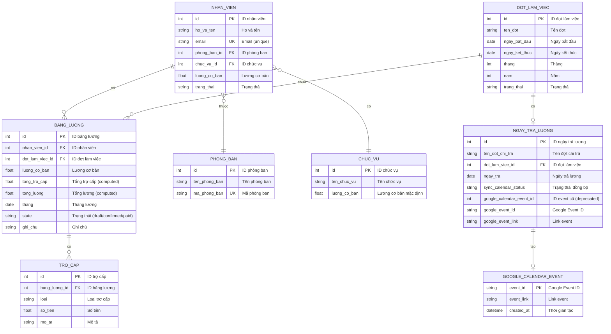
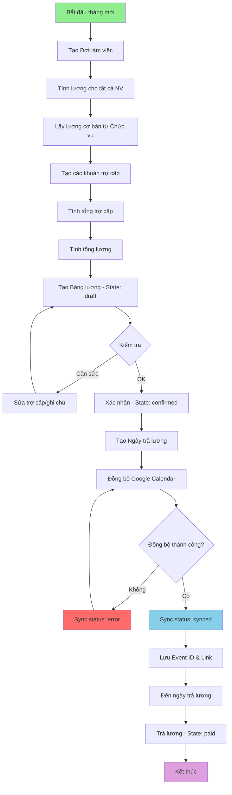
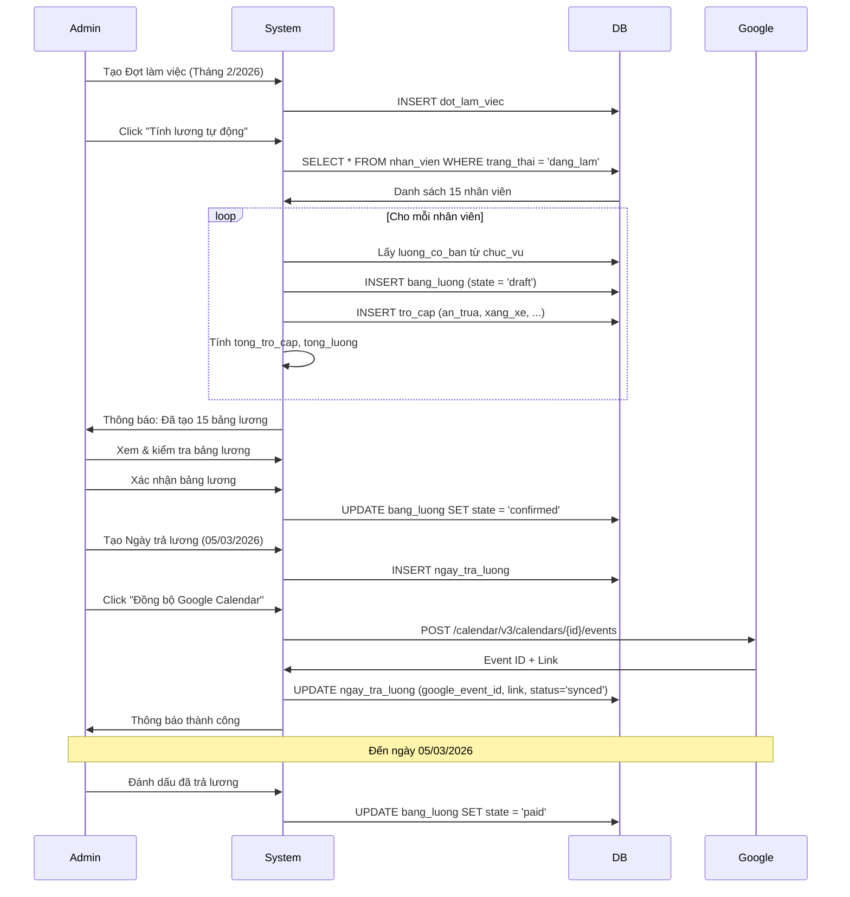
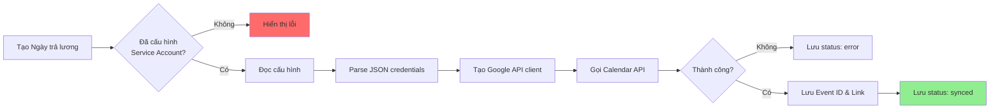

# 🗄️ SƠ ĐỒ ERD - MODULE QUẢN LÝ TÍNH LƯƠNG

## 1. Sơ đồ ERD tổng quan (Mermaid)



---

## 2. Mô tả chi tiết các bảng

### 📋 Bảng 1: NHAN_VIEN (Từ module QLNS)

**Mục đích:** Lưu thông tin nhân viên

| Cột | Kiểu | Ràng buộc | Mô tả | Ví dụ |
|-----|------|-----------|-------|-------|
| `id` | Integer | PK | ID nhân viên | 1 |
| `ho_va_ten` | Varchar(100) | NOT NULL | Họ và tên | "Nguyễn Văn A" |
| `email` | Varchar(100) | UNIQUE, NOT NULL | Email | "nguyenvana@company.com" |
| `phong_ban_id` | Integer | FK → phong_ban.id | Phòng ban | 1 |
| `chuc_vu_id` | Integer | FK → chuc_vu.id | Chức vụ | 2 |
| `luong_co_ban` | Float | | Lương cơ bản (VNĐ) | 10000000 |
| `trang_thai` | Selection | | dang_lam/nghi_viec | "dang_lam" |

---

### 📋 Bảng 2: DOT_LAM_VIEC

**Mục đích:** Quản lý các đợt làm việc (tháng)

| Cột | Kiểu | Ràng buộc | Mô tả | Ví dụ |
|-----|------|-----------|-------|-------|
| `id` | Integer | PK | ID đợt làm việc | 1 |
| `ten_dot` | Varchar(100) | NOT NULL | Tên đợt | "Tháng 2/2026" |
| `ngay_bat_dau` | Date | NOT NULL | Ngày bắt đầu | 2026-02-01 |
| `ngay_ket_thuc` | Date | NOT NULL | Ngày kết thúc | 2026-02-28 |
| `thang` | Integer | NOT NULL | Tháng (1-12) | 2 |
| `nam` | Integer | NOT NULL | Năm | 2026 |
| `trang_thai` | Selection | DEFAULT 'dang_mo' | dang_mo/da_dong | "dang_mo" |

**Constraints:**
- `CHECK (ngay_ket_thuc > ngay_bat_dau)`
- `CHECK (thang BETWEEN 1 AND 12)`
- `UNIQUE (thang, nam)`

**Business Rules:**
- Mỗi tháng chỉ có 1 đợt làm việc
- Không thể sửa/xóa đợt đã có bảng lương

---

### 📋 Bảng 3: BANG_LUONG (Bảng chính)

**Mục đích:** Lưu thông tin lương của nhân viên theo tháng

| Cột | Kiểu | Ràng buộc | Mô tả | Ví dụ |
|-----|------|-----------|-------|-------|
| `id` | Integer | PK | ID bảng lương | 1 |
| `nhan_vien_id` | Integer | FK, NOT NULL | Nhân viên | 1 |
| `dot_lam_viec_id` | Integer | FK, NOT NULL | Đợt làm việc | 1 |
| `luong_co_ban` | Float | NOT NULL | Lương cơ bản | 10000000 |
| `tong_tro_cap` | Float | Computed | Tổng trợ cấp | 2000000 |
| `tong_luong` | Float | Computed | Tổng lương | 12000000 |
| `thang` | Date | | Tháng lương | 2026-02-01 |
| `state` | Selection | DEFAULT 'draft' | Trạng thái | "draft" |
| `ghi_chu` | Text | | Ghi chú | "Lương tháng 2" |

**Constraints:**
- `UNIQUE (nhan_vien_id, dot_lam_viec_id)`

**Indexes:**
- `idx_bang_luong_nhan_vien` ON `nhan_vien_id`
- `idx_bang_luong_dot` ON `dot_lam_viec_id`
- `idx_bang_luong_thang` ON `thang`

**Computed Fields Logic:**

```python
# Tính tổng trợ cấp
tong_tro_cap = SUM(tro_cap.so_tien WHERE tro_cap.bang_luong_id = id)

# Tính tổng lương
tong_luong = luong_co_ban + tong_tro_cap
```

**Trạng thái (State):**
| State | Mô tả | Hành động |
|-------|-------|-----------|
| `draft` | Nháp | Có thể sửa/xóa |
| `confirmed` | Đã xác nhận | Chỉ xem, không sửa |
| `paid` | Đã trả | Đã trả lương |

**Workflow:**
```
draft → (Xác nhận) → confirmed → (Trả lương) → paid
```

---

### 📋 Bảng 4: TRO_CAP

**Mục đích:** Lưu các khoản trợ cấp của nhân viên

| Cột | Kiểu | Ràng buộc | Mô tả | Ví dụ |
|-----|------|-----------|-------|-------|
| `id` | Integer | PK | ID trợ cấp | 1 |
| `bang_luong_id` | Integer | FK, NOT NULL | Bảng lương | 1 |
| `loai` | Selection | NOT NULL | Loại trợ cấp | "an_trua" |
| `so_tien` | Float | NOT NULL | Số tiền (VNĐ) | 600000 |
| `mo_ta` | Text | | Mô tả chi tiết | "Tiền ăn trưa 20 ngày" |

**Indexes:**
- `idx_tro_cap_bang_luong` ON `bang_luong_id`
- `idx_tro_cap_loai` ON `loai`

**Loại trợ cấp:**

| Loại | Tên hiển thị | Số tiền mặc định | Đơn vị | Mô tả |
|------|--------------|------------------|--------|-------|
| `an_trua` | Tiền ăn trưa | 30,000 | VNĐ/ngày | Tính theo số ngày làm việc |
| `xang_xe` | Tiền xăng xe | 500,000 | VNĐ/tháng | Cố định hàng tháng |
| `dien_thoai` | Tiền điện thoại | 200,000 | VNĐ/tháng | Cố định hàng tháng |
| `nha_o` | Tiền nhà ở | 1,000,000 | VNĐ/tháng | Tùy theo vị trí |
| `khac` | Trợ cấp khác | Tùy chỉnh | VNĐ | Các khoản khác |

**Ví dụ tính toán:**
```python
# Tiền ăn trưa: 30,000 VNĐ/ngày × 20 ngày = 600,000 VNĐ
tro_cap_an_trua = 30000 * so_ngay_lam_viec

# Tổng trợ cấp
tong_tro_cap = tro_cap_an_trua + tro_cap_xang_xe + tro_cap_dien_thoai + ...
```

---

### 📋 Bảng 5: NGAY_TRA_LUONG

**Mục đích:** Quản lý ngày trả lương và tích hợp Google Calendar

| Cột | Kiểu | Ràng buộc | Mô tả | Ví dụ |
|-----|------|-----------|-------|-------|
| `id` | Integer | PK | ID | 1 |
| `ten_dot_chi_tra` | Varchar(100) | | Tên đợt chi trả | "Trả lương tháng 2/2026" |
| `dot_lam_viec_id` | Integer | FK, NOT NULL | Đợt làm việc | 1 |
| `ngay_tra` | Date | NOT NULL | Ngày trả lương | 2026-03-05 |
| `sync_calendar_status` | Selection | DEFAULT 'not_synced' | Trạng thái đồng bộ | "not_synced" |
| `google_calendar_event_id` | Integer | Deprecated | ID event cũ | NULL |
| `google_event_id` | Varchar(100) | | Google Event ID | "abc123xyz" |
| `google_event_link` | Varchar(500) | | Link event | "https://calendar.google.com/..." |

**Constraints:**
- `CHECK (ngay_tra >= dot_lam_viec.ngay_ket_thuc)`
- `UNIQUE (dot_lam_viec_id)`

**Indexes:**
- `idx_ngay_tra_luong_dot` ON `dot_lam_viec_id`
- `idx_ngay_tra_luong_ngay` ON `ngay_tra`

**Trạng thái đồng bộ:**
| Status | Mô tả |
|--------|-------|
| `not_synced` | Chưa đồng bộ |
| `synced` | Đã đồng bộ thành công |
| `error` | Lỗi khi đồng bộ |

**Business Rules:**
- Ngày trả lương phải >= ngày kết thúc đợt làm việc
- Mỗi đợt làm việc chỉ có 1 ngày trả lương
- Không thể sửa ngày trả nếu đã đồng bộ Google Calendar

---

## 3. Quan hệ giữa các bảng

### 🔗 Mối quan hệ

| Bảng 1 | Quan hệ | Bảng 2 | Mô tả |
|--------|---------|--------|-------|
| NHAN_VIEN | 1:N | BANG_LUONG | 1 NV có nhiều bảng lương (theo tháng) |
| DOT_LAM_VIEC | 1:N | BANG_LUONG | 1 đợt có nhiều bảng lương (nhiều NV) |
| BANG_LUONG | 1:N | TRO_CAP | 1 bảng lương có nhiều trợ cấp |
| DOT_LAM_VIEC | 1:1 | NGAY_TRA_LUONG | 1 đợt có 1 ngày trả |
| NHAN_VIEN | N:1 | PHONG_BAN | Nhiều NV thuộc 1 phòng ban |
| NHAN_VIEN | N:1 | CHUC_VU | Nhiều NV có 1 chức vụ |

### 🔑 Foreign Keys

```sql
-- Bảng BANG_LUONG
ALTER TABLE tinh_luong_bang_luong
ADD CONSTRAINT fk_bang_luong_nhan_vien 
FOREIGN KEY (nhan_vien_id) REFERENCES nhan_vien(id) ON DELETE CASCADE;

ALTER TABLE tinh_luong_bang_luong
ADD CONSTRAINT fk_bang_luong_dot 
FOREIGN KEY (dot_lam_viec_id) REFERENCES dot_lam_viec(id) ON DELETE RESTRICT;

-- Bảng TRO_CAP
ALTER TABLE tinh_luong_tro_cap
ADD CONSTRAINT fk_tro_cap_bang_luong 
FOREIGN KEY (bang_luong_id) REFERENCES tinh_luong_bang_luong(id) ON DELETE CASCADE;

-- Bảng NGAY_TRA_LUONG
ALTER TABLE tinh_luong_ngay_tra_luong
ADD CONSTRAINT fk_ngay_tra_dot 
FOREIGN KEY (dot_lam_viec_id) REFERENCES dot_lam_viec(id) ON DELETE CASCADE;
```

---

## 4. Quy trình nghiệp vụ

### 🔄 Quy trình tính lương



### 📊 Sequence Diagram - Tính lương tự động



---

## 5. Ví dụ dữ liệu

### Kịch bản: Tính lương cho Nguyễn Văn A - Tháng 2/2026

```sql
-- 1. Nhân viên (từ module QLNS)
INSERT INTO nhan_vien (id, ho_va_ten, email, chuc_vu_id, luong_co_ban, trang_thai)
VALUES (1, 'Nguyễn Văn A', 'nguyenvana@company.com', 2, 10000000, 'dang_lam');

-- 2. Chức vụ
INSERT INTO chuc_vu (id, ten_chuc_vu, luong_co_ban)
VALUES (2, 'Nhân viên', 10000000);

-- 3. Đợt làm việc
INSERT INTO dot_lam_viec (id, ten_dot, ngay_bat_dau, ngay_ket_thuc, thang, nam, trang_thai)
VALUES (1, 'Tháng 2/2026', '2026-02-01', '2026-02-28', 2, 2026, 'dang_mo');

-- 4. Bảng lương
INSERT INTO tinh_luong_bang_luong (id, nhan_vien_id, dot_lam_viec_id, luong_co_ban, thang, state)
VALUES (1, 1, 1, 10000000, '2026-02-01', 'draft');

-- 5. Trợ cấp
INSERT INTO tinh_luong_tro_cap (bang_luong_id, loai, so_tien, mo_ta) VALUES
(1, 'an_trua', 600000, 'Tiền ăn trưa: 30,000 × 20 ngày'),
(1, 'xang_xe', 500000, 'Tiền xăng xe tháng 2'),
(1, 'dien_thoai', 200000, 'Tiền điện thoại tháng 2');

-- Kết quả computed:
-- tong_tro_cap = 600,000 + 500,000 + 200,000 = 1,300,000
-- tong_luong = 10,000,000 + 1,300,000 = 11,300,000

-- 6. Xác nhận bảng lương
UPDATE tinh_luong_bang_luong SET state = 'confirmed' WHERE id = 1;

-- 7. Tạo ngày trả lương
INSERT INTO tinh_luong_ngay_tra_luong (id, ten_dot_chi_tra, dot_lam_viec_id, ngay_tra, sync_calendar_status)
VALUES (1, 'Trả lương tháng 2/2026', 1, '2026-03-05', 'not_synced');

-- 8. Đồng bộ Google Calendar (sau khi gọi API)
UPDATE tinh_luong_ngay_tra_luong 
SET google_event_id = 'abc123xyz',
    google_event_link = 'https://calendar.google.com/event?eid=abc123xyz',
    sync_calendar_status = 'synced'
WHERE id = 1;

-- 9. Đánh dấu đã trả lương (ngày 05/03/2026)
UPDATE tinh_luong_bang_luong SET state = 'paid' WHERE id = 1;
```

---

## 6. Queries thường dùng

### Query 1: Tổng lương theo phòng ban (Tháng 2/2026)

```sql
SELECT 
    pb.ten_phong_ban,
    COUNT(bl.id) as so_nhan_vien,
    SUM(bl.luong_co_ban) as tong_luong_co_ban,
    SUM(bl.tong_tro_cap) as tong_tro_cap,
    SUM(bl.tong_luong) as tong_luong
FROM tinh_luong_bang_luong bl
JOIN nhan_vien nv ON bl.nhan_vien_id = nv.id
JOIN phong_ban pb ON nv.phong_ban_id = pb.id
WHERE bl.thang = '2026-02-01'
GROUP BY pb.id, pb.ten_phong_ban
ORDER BY tong_luong DESC;
```

### Query 2: Chi tiết lương của 1 nhân viên

```sql
SELECT 
    nv.ho_va_ten,
    bl.thang,
    bl.luong_co_ban,
    tc.loai,
    tc.so_tien,
    tc.mo_ta
FROM tinh_luong_bang_luong bl
JOIN nhan_vien nv ON bl.nhan_vien_id = nv.id
LEFT JOIN tinh_luong_tro_cap tc ON bl.id = tc.bang_luong_id
WHERE nv.id = 1
  AND bl.thang = '2026-02-01'
ORDER BY tc.loai;
```

### Query 3: Thống kê trợ cấp theo loại

```sql
SELECT 
    tc.loai,
    COUNT(*) as so_luong,
    SUM(tc.so_tien) as tong_tien,
    AVG(tc.so_tien) as trung_binh
FROM tinh_luong_tro_cap tc
JOIN tinh_luong_bang_luong bl ON tc.bang_luong_id = bl.id
WHERE bl.thang = '2026-02-01'
GROUP BY tc.loai
ORDER BY tong_tien DESC;
```

### Query 4: Danh sách chưa trả lương

```sql
SELECT 
    nv.ho_va_ten,
    bl.thang,
    bl.tong_luong,
    bl.state,
    ntl.ngay_tra
FROM tinh_luong_bang_luong bl
JOIN nhan_vien nv ON bl.nhan_vien_id = nv.id
LEFT JOIN tinh_luong_ngay_tra_luong ntl ON bl.dot_lam_viec_id = ntl.dot_lam_viec_id
WHERE bl.state != 'paid'
ORDER BY bl.thang DESC, nv.ho_va_ten;
```

### Query 5: Lịch sử lương của nhân viên (6 tháng gần nhất)

```sql
SELECT 
    bl.thang,
    bl.luong_co_ban,
    bl.tong_tro_cap,
    bl.tong_luong,
    bl.state
FROM tinh_luong_bang_luong bl
WHERE bl.nhan_vien_id = 1
ORDER BY bl.thang DESC
LIMIT 6;
```

---

## 7. Tích hợp Google Calendar

### 🔗 Quy trình đồng bộ



### 📅 Thông tin Event trên Google Calendar

**Event Title:** `💰 Trả lương - Tháng 2/2026`

**Event Date:** Ngày trả lương (ví dụ: 05/03/2026)

**Event Description:**
```
Ngày trả lương cho đợt: Tháng 2/2026
Số nhân viên: 15
Tổng lương: 150,000,000 VNĐ
```

**Reminders:**
- Email: 1 ngày trước (04/03/2026)
- Popup: 1 giờ trước

---

## 8. Công thức tính lương

### 💰 Công thức tổng quát

```
Tổng lương = Lương cơ bản + Tổng trợ cấp
```

### 📊 Chi tiết tính toán

```python
# 1. Lương cơ bản (lấy từ Chức vụ)
luong_co_ban = nhan_vien.chuc_vu_id.luong_co_ban

# 2. Trợ cấp ăn trưa (tính theo ngày làm việc)
so_ngay_lam_viec = 20  # Ví dụ: 20 ngày
tro_cap_an_trua = 30000 * so_ngay_lam_viec  # = 600,000

# 3. Trợ cấp xăng xe (cố định)
tro_cap_xang_xe = 500000

# 4. Trợ cấp điện thoại (cố định)
tro_cap_dien_thoai = 200000

# 5. Trợ cấp nhà ở (nếu có)
tro_cap_nha_o = 1000000  # Hoặc 0

# 6. Tổng trợ cấp
tong_tro_cap = tro_cap_an_trua + tro_cap_xang_xe + tro_cap_dien_thoai + tro_cap_nha_o

# 7. Tổng lương
tong_luong = luong_co_ban + tong_tro_cap
```

### 📈 Ví dụ cụ thể

**Nhân viên:** Nguyễn Văn A  
**Chức vụ:** Nhân viên  
**Lương cơ bản:** 10,000,000 VNĐ

| Khoản | Số tiền (VNĐ) | Ghi chú |
|-------|---------------|---------|
| Lương cơ bản | 10,000,000 | Từ chức vụ |
| Tiền ăn trưa | 600,000 | 30,000 × 20 ngày |
| Tiền xăng xe | 500,000 | Cố định |
| Tiền điện thoại | 200,000 | Cố định |
| **Tổng trợ cấp** | **1,300,000** | |
| **TỔNG LƯƠNG** | **11,300,000** | |

---

## 9. Báo cáo & Thống kê

### 📊 Các loại báo cáo

1. **Báo cáo tổng hợp lương theo tháng**
   - Tổng lương cơ bản
   - Tổng trợ cấp
   - Tổng lương
   - Số nhân viên

2. **Báo cáo lương theo phòng ban**
   - Phân tích theo từng phòng ban
   - So sánh giữa các phòng ban

3. **Báo cáo trợ cấp**
   - Phân bổ theo loại trợ cấp
   - Top nhân viên có trợ cấp cao

4. **Báo cáo xu hướng lương**
   - Biểu đồ lương theo tháng
   - Tăng trưởng lương

---

**Tạo bởi:** Hệ thống Quản lý Nhân sự  
**Ngày:** 02/02/2026  
**Module:** Tính lương
