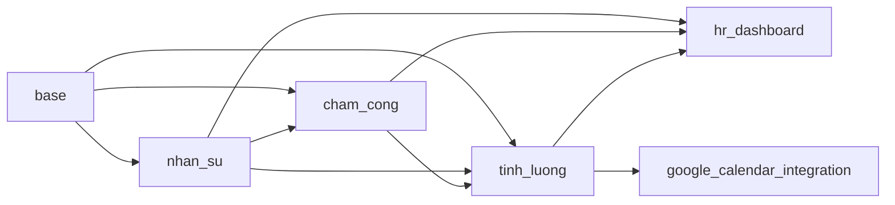
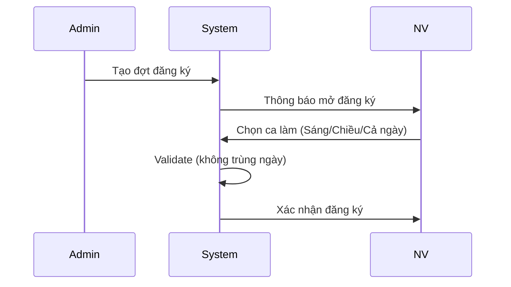
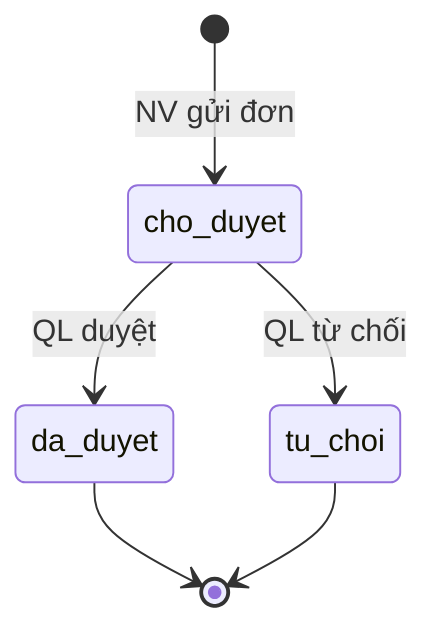
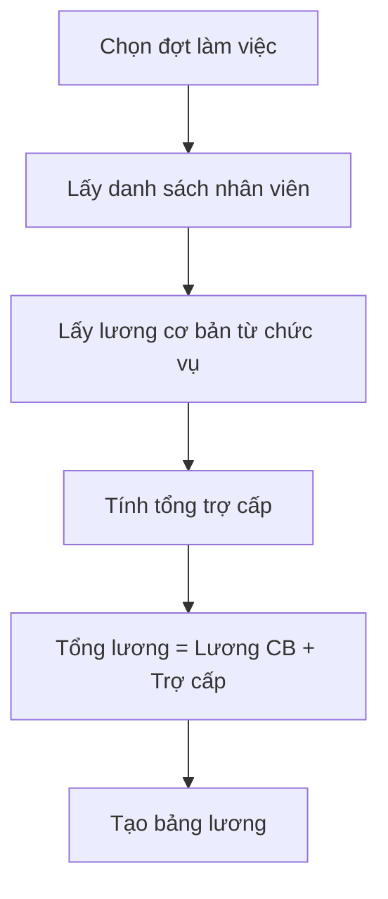
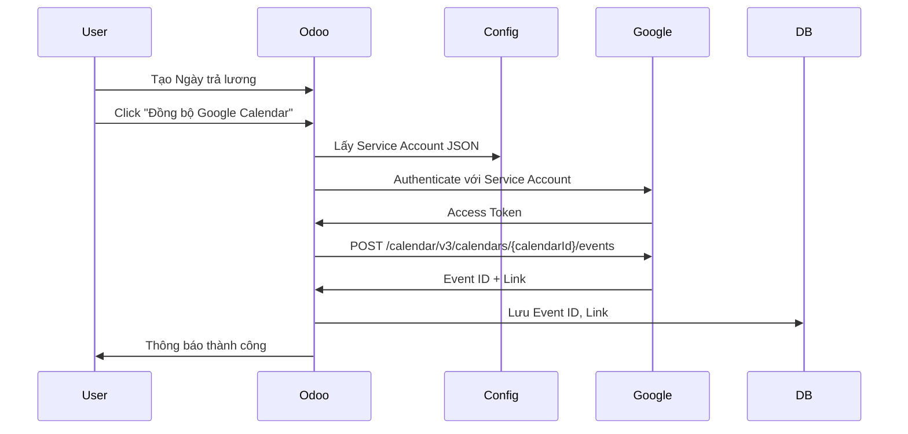

# 📋 PHÂN TÍCH HỆ THỐNG QUẢN LÝ NHÂN SỰ

## 📖 MỤC LỤC
1. [Giới thiệu](#giới-thiệu)
2. [Các module phụ thuộc](#các-module-phụ-thuộc)
3. [Yêu cầu chức năng](#yêu-cầu-chức-năng)
4. [Cơ sở dữ liệu](#cơ-sở-dữ-liệu)

---

## 1. GIỚI THIỆU

### 1.1. Tổng quan dự án

**Tên dự án:** Hệ thống Quản lý Nhân sự  
**Nền tảng:** Odoo 15.0  
**Ngôn ngữ:** Python 3.10  
**Cơ sở dữ liệu:** PostgreSQL 12+  
**Kiến trúc:** MVC (Model-View-Controller), Layered Architecture

### 1.2. Mục tiêu

Xây dựng hệ thống quản lý nhân sự toàn diện bao gồm:
- ✅ Quản lý thông tin nhân viên, phòng ban, chức vụ
- ✅ Chấm công tự động với xử lý đơn từ
- ✅ Tính lương tự động theo công thức
- ✅ Dashboard phân tích dữ liệu
- ✅ Tích hợp Google Calendar API (External API)

### 1.3. Phạm vi

**Trong phạm vi:**
- 4 module chính: QLNS, Chấm công, Tính lương, Dashboard
- 1 module tích hợp: Google Calendar Integration
- Demo data: 15 nhân viên, 5 phòng ban

**Ngoài phạm vi:**
- Quản lý tuyển dụng
- Đánh giá hiệu suất
- Quản lý đào tạo

---

## 2. CÁC MODULE PHỤ THUỘC

### 2.1. Module Odoo Core

| Module | Phiên bản | Mục đích |
|--------|-----------|----------|
| `base` | 15.0 | Cung cấp models cơ bản (res.partner, ir.model, etc.) |
| `web` | 15.0 | Web framework, controllers, views |

### 2.2. Module Custom



**Quan hệ phụ thuộc:**
- `nhan_su`: Phụ thuộc `base`
- `cham_cong`: Phụ thuộc `base`, `nhan_su`
- `tinh_luong`: Phụ thuộc `base`, `nhan_su`, `cham_cong`
- `hr_dashboard`: Phụ thuộc `base`, `nhan_su`, `cham_cong`, `tinh_luong`
- `google_calendar_integration`: Phụ thuộc `base`, `tinh_luong`

### 2.3. Thư viện Python

```python
# requirements.txt
odoo==15.0
psycopg2-binary==2.9.9
google-auth==2.48.0
google-auth-oauthlib==1.2.4
google-api-python-client==2.188.0
```

---

## 3. YÊU CẦU CHỨC NĂNG

### 3.1. MODULE QLNS (Nhân sự)

#### 3.1.1. Quản lý Nhân viên

**Mã chức năng:** QLNS-NV-001

**Mô tả:** Quản lý thông tin cá nhân và công việc của nhân viên

**Actor:** Admin, Quản lý, Nhân viên

**Chức năng chi tiết:**

| STT | Chức năng | Mô tả | Quyền |
|-----|-----------|-------|-------|
| 1 | Thêm nhân viên | Tạo hồ sơ nhân viên mới | Admin, QL |
| 2 | Sửa thông tin | Cập nhật thông tin nhân viên | Admin, QL |
| 3 | Xóa nhân viên | Xóa hồ sơ (soft delete) | Admin |
| 4 | Xem danh sách | Hiển thị danh sách nhân viên | Tất cả |
| 5 | Tìm kiếm | Tìm theo tên, email, phòng ban | Tất cả |
| 6 | Xuất báo cáo | Export Excel/PDF | Admin, QL |

**Quy tắc nghiệp vụ:**
- Email phải unique
- Ngày sinh phải < ngày hiện tại
- Phải thuộc 1 phòng ban và 1 chức vụ
- Lương cơ bản lấy từ chức vụ

#### 3.1.2. Quản lý Phòng ban

**Mã chức năng:** QLNS-PB-001

**Chức năng:**
- CRUD phòng ban
- Mã phòng ban unique
- Hiển thị số lượng nhân viên

#### 3.1.3. Quản lý Chức vụ

**Mã chức năng:** QLNS-CV-001

**Chức năng:**
- CRUD chức vụ
- Thiết lập lương cơ bản theo chức vụ
- Hiển thị số lượng nhân viên

---

### 3.2. MODULE CHẤM CÔNG

#### 3.2.1. Đăng ký ca làm

**Mã chức năng:** CC-DK-001

**Quy trình:**


**Loại ca làm:**
| Ca | Giờ vào | Giờ ra | Số giờ |
|----|---------|--------|--------|
| Sáng | 07:30 | 11:30 | 4h |
| Chiều | 13:30 | 17:30 | 4h |
| Cả ngày | 07:30 | 17:30 | 8h |

#### 3.2.2. Chấm công

**Mã chức năng:** CC-CC-001

**Chức năng tự động:**
- Lấy ca làm đã đăng ký
- Tính giờ vào ca, giờ ra ca theo ca làm
- Ghi nhận giờ vào/ra thực tế
- Tính phút đi muộn = max(0, giờ vào thực tế - giờ vào ca)
- Tính phút về sớm = max(0, giờ ra ca - giờ ra thực tế)

**Trạng thái chấm công:**
- `di_lam`: Đi làm đúng giờ
- `di_muon`: Đi muộn > 0 phút
- `ve_som`: Về sớm > 0 phút
- `di_muon_ve_som`: Cả 2
- `vang_mat`: Không có giờ vào/ra
- `vang_mat_co_phep`: Có đơn từ nghỉ phép

#### 3.2.3. Quản lý đơn từ

**Mã chức năng:** CC-DT-001

**Loại đơn:**
- `di_muon`: Xin đi muộn
- `ve_som`: Xin về sớm
- `nghi_phep`: Xin nghỉ phép

**Quy trình duyệt:**


**Tác động:**
- Đơn `di_muon` được duyệt → Giảm phút đi muộn
- Đơn `ve_som` được duyệt → Giảm phút về sớm
- Đơn `nghi_phep` được duyệt → Trạng thái = vắng mặt có phép

---

### 3.3. MODULE TÍNH LƯƠNG

#### 3.3.1. Tính lương tự động

**Mã chức năng:** TL-TL-001

**Công thức:**
```
Tổng lương = Lương cơ bản + Tổng trợ cấp
```

**Quy trình:**


#### 3.3.2. Quản lý trợ cấp

**Mã chức năng:** TL-TC-001

**Loại trợ cấp:**
| Loại | Mô tả | Số tiền mặc định |
|------|-------|------------------|
| an_trua | Tiền ăn trưa | 30,000 VNĐ/ngày |
| xang_xe | Tiền xăng xe | 500,000 VNĐ/tháng |
| dien_thoai | Tiền điện thoại | 200,000 VNĐ/tháng |
| nha_o | Tiền nhà ở | 1,000,000 VNĐ/tháng |
| khac | Trợ cấp khác | Tùy chỉnh |

#### 3.3.3. Ngày trả lương

**Mã chức năng:** TL-NTL-001

**Chức năng:**
- Thiết lập ngày trả lương cho đợt làm việc
- Ràng buộc: Ngày trả >= Ngày kết thúc đợt
- Tích hợp Google Calendar

---

### 3.4. MODULE DASHBOARD

#### 3.4.1. Biểu đồ thống kê

**Mã chức năng:** DB-BD-001

**Các biểu đồ:**

| STT | Tên biểu đồ | Loại | Dữ liệu |
|-----|-------------|------|---------|
| 1 | Nhân viên theo phòng ban | Bar | Đếm số NV/phòng ban |
| 2 | Nhân viên theo chức vụ | Pie | Phân bổ % theo chức vụ |
| 3 | Trạng thái chấm công | Pie | Phân bổ trạng thái |
| 4 | Phút đi muộn theo NV | Bar | Tổng phút đi muộn |
| 5 | Lương theo nhân viên | Bar | Tổng lương/NV |
| 6 | Trợ cấp theo loại | Pie | Phân bổ trợ cấp |

---

### 3.5. MODULE GOOGLE CALENDAR INTEGRATION

#### 3.5.1. Đồng bộ Google Calendar

**Mã chức năng:** GC-DB-001

**Công nghệ:** Google Calendar API v3, Service Account

**Quy trình:**


**Thông tin Event:**
- **Title:** "💰 Trả lương - [Tên đợt]"
- **Date:** Ngày trả lương
- **Reminder:** Email (1 ngày trước), Popup (1 giờ trước)

---

## 4. CƠ SỞ DỮ LIỆU

### 4.1. MODULE QLNS

#### Bảng: `nhan_vien`

| Tên cột | Kiểu dữ liệu | Ràng buộc | Mô tả |
|---------|--------------|-----------|-------|
| `id` | Integer | PK, Auto | ID nhân viên |
| `ho_va_ten` | Varchar(100) | NOT NULL | Họ và tên |
| `email` | Varchar(100) | UNIQUE, NOT NULL | Email |
| `so_dien_thoai` | Varchar(15) | | Số điện thoại |
| `ngay_sinh` | Date | | Ngày sinh |
| `gioi_tinh` | Selection | | Nam/Nữ/Khác |
| `dia_chi` | Text | | Địa chỉ |
| `phong_ban_id` | Integer | FK → phong_ban | Phòng ban |
| `chuc_vu_id` | Integer | FK → chuc_vu | Chức vụ |
| `luong_co_ban` | Float | | Lương cơ bản |
| `ngay_vao_lam` | Date | | Ngày vào làm |
| `trang_thai` | Selection | | Đang làm/Nghỉ việc |

**Indexes:**
- `idx_email` ON `email`
- `idx_phong_ban` ON `phong_ban_id`

#### Bảng: `phong_ban`

| Tên cột | Kiểu | Ràng buộc | Mô tả |
|---------|------|-----------|-------|
| `id` | Integer | PK | ID phòng ban |
| `ten_phong_ban` | Varchar(100) | NOT NULL | Tên phòng ban |
| `ma_phong_ban` | Varchar(20) | UNIQUE | Mã phòng ban |

#### Bảng: `chuc_vu`

| Tên cột | Kiểu | Ràng buộc | Mô tả |
|---------|------|-----------|-------|
| `id` | Integer | PK | ID chức vụ |
| `ten_chuc_vu` | Varchar(100) | NOT NULL | Tên chức vụ |
| `luong_co_ban` | Float | | Lương cơ bản |

---

### 4.2. MODULE CHẤM CÔNG

#### Bảng: `bang_cham_cong`

| Tên cột | Kiểu | Ràng buộc | Mô tả |
|---------|------|-----------|-------|
| `id` | Integer | PK | ID |
| `nhan_vien_id` | Integer | FK, NOT NULL | Nhân viên |
| `ngay_cham_cong` | Date | NOT NULL | Ngày chấm công |
| `dang_ky_ca_lam_id` | Integer | FK | Ca làm đã đăng ký |
| `ca_lam` | Selection | | Sáng/Chiều/Cả ngày |
| `gio_vao_ca` | Datetime | Computed | Giờ vào ca (tính toán) |
| `gio_ra_ca` | Datetime | Computed | Giờ ra ca (tính toán) |
| `gio_vao` | Datetime | | Giờ vào thực tế |
| `gio_ra` | Datetime | | Giờ ra thực tế |
| `phut_di_muon_goc` | Float | Computed | Phút đi muộn gốc |
| `phut_di_muon` | Float | Computed | Phút đi muộn sau điều chỉnh |
| `phut_ve_som_goc` | Float | Computed | Phút về sớm gốc |
| `phut_ve_som` | Float | Computed | Phút về sớm sau điều chỉnh |
| `trang_thai` | Selection | Computed | Trạng thái chấm công |
| `don_tu_id` | Integer | FK | Đơn từ liên quan |

**Constraints:**
- UNIQUE(`nhan_vien_id`, `ngay_cham_cong`)

#### Bảng: `dang_ky_ca_lam_theo_ngay`

| Tên cột | Kiểu | Ràng buộc | Mô tả |
|---------|------|-----------|-------|
| `id` | Integer | PK | ID |
| `nhan_vien_id` | Integer | FK | Nhân viên |
| `dot_dang_ky_id` | Integer | FK | Đợt đăng ký |
| `ngay_lam` | Date | NOT NULL | Ngày làm việc |
| `ca_lam` | Selection | NOT NULL | Ca làm |

**Constraints:**
- UNIQUE(`nhan_vien_id`, `ngay_lam`)

#### Bảng: `don_tu`

| Tên cột | Kiểu | Ràng buộc | Mô tả |
|---------|------|-----------|-------|
| `id` | Integer | PK | ID |
| `nhan_vien_id` | Integer | FK | Nhân viên |
| `loai_don` | Selection | NOT NULL | Loại đơn |
| `ngay_ap_dung` | Date | NOT NULL | Ngày áp dụng |
| `thoi_gian_xin` | Float | | Thời gian xin (phút) |
| `ly_do` | Text | | Lý do |
| `trang_thai_duyet` | Selection | | Trạng thái duyệt |

---

### 4.3. MODULE TÍNH LƯƠNG

#### Bảng: `tinh_luong.bang_luong`

| Tên cột | Kiểu | Ràng buộc | Mô tả |
|---------|------|-----------|-------|
| `id` | Integer | PK | ID |
| `nhan_vien_id` | Integer | FK | Nhân viên |
| `dot_lam_viec_id` | Integer | FK | Đợt làm việc |
| `luong_co_ban` | Float | | Lương cơ bản |
| `tong_tro_cap` | Float | Computed | Tổng trợ cấp |
| `tong_luong` | Float | Computed | Tổng lương |
| `thang` | Date | | Tháng |

#### Bảng: `tinh_luong.tro_cap`

| Tên cột | Kiểu | Ràng buộc | Mô tả |
|---------|------|-----------|-------|
| `id` | Integer | PK | ID |
| `bang_luong_id` | Integer | FK | Bảng lương |
| `loai` | Selection | NOT NULL | Loại trợ cấp |
| `so_tien` | Float | NOT NULL | Số tiền |

#### Bảng: `tinh_luong.ngay_tra_luong`

| Tên cột | Kiểu | Ràng buộc | Mô tả |
|---------|------|-----------|-------|
| `id` | Integer | PK | ID |
| `ten_dot_chi_tra` | Varchar(100) | | Tên đợt |
| `dot_lam_viec_id` | Integer | FK | Đợt làm việc |
| `ngay_tra` | Date | NOT NULL | Ngày trả |
| `google_event_id` | Varchar(100) | | Event ID từ Google |
| `google_event_link` | Varchar(500) | | Link event |
| `sync_calendar_status` | Selection | | Trạng thái đồng bộ |

---

### 4.4. MODULE GOOGLE CALENDAR INTEGRATION

#### Bảng: `google.calendar.config`

| Tên cột | Kiểu | Ràng buộc | Mô tả |
|---------|------|-----------|-------|
| `id` | Integer | PK | ID |
| `name` | Varchar(100) | | Tên cấu hình |
| `calendar_id` | Varchar(200) | NOT NULL | Calendar ID (email) |
| `service_account_json` | Text | | Service Account JSON |
| `active` | Boolean | | Kích hoạt |

---

## 📊 THỐNG KÊ

**Tổng số bảng:** 12 bảng  
**Tổng số module:** 5 modules  
**Tổng số chức năng:** 20+ chức năng  
**Demo data:** 15 nhân viên, 20 bảng chấm công, 15 bảng lương

---

**Người thực hiện:** [Tên của bạn]  
**Ngày:** 02/02/2026  
**Phiên bản:** 1.0
