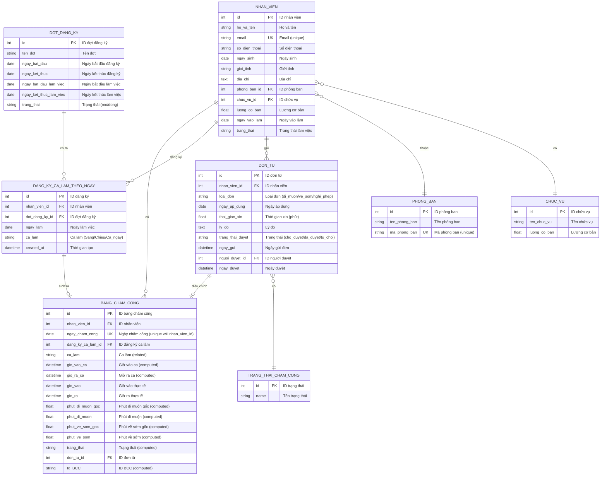

# 🗄️ SƠ ĐỒ ERD - MODULE QUẢN LÝ CHẤM CÔNG

## 1. Sơ đồ ERD tổng quan (Mermaid)



---

## 2. Mô tả chi tiết các bảng

### 📋 Bảng 1: NHAN_VIEN (Từ module QLNS)

**Mục đích:** Lưu thông tin nhân viên

| Cột | Kiểu | Ràng buộc | Mô tả | Ví dụ |
|-----|------|-----------|-------|-------|
| `id` | Integer | PK, Auto Increment | ID duy nhất | 1 |
| `ho_va_ten` | Varchar(100) | NOT NULL | Họ và tên đầy đủ | "Nguyễn Văn A" |
| `email` | Varchar(100) | UNIQUE, NOT NULL | Email công ty | "nguyenvana@company.com" |
| `so_dien_thoai` | Varchar(15) | | Số điện thoại | "0901234567" |
| `ngay_sinh` | Date | | Ngày sinh | 1990-01-15 |
| `gioi_tinh` | Selection | | Nam/Nữ/Khác | "Nam" |
| `dia_chi` | Text | | Địa chỉ liên hệ | "123 Đường ABC, Q1, HCM" |
| `phong_ban_id` | Integer | FK → phong_ban.id | Phòng ban | 1 |
| `chuc_vu_id` | Integer | FK → chuc_vu.id | Chức vụ | 2 |
| `luong_co_ban` | Float | | Lương cơ bản (VNĐ) | 10000000 |
| `ngay_vao_lam` | Date | | Ngày bắt đầu làm việc | 2020-01-01 |
| `trang_thai` | Selection | | dang_lam/nghi_viec | "dang_lam" |

**Indexes:**
- `idx_nhan_vien_email` ON `email`
- `idx_nhan_vien_phong_ban` ON `phong_ban_id`

---

### 📋 Bảng 2: DOT_DANG_KY

**Mục đích:** Quản lý các đợt đăng ký ca làm

| Cột | Kiểu | Ràng buộc | Mô tả | Ví dụ |
|-----|------|-----------|-------|-------|
| `id` | Integer | PK | ID đợt | 1 |
| `ten_dot` | Varchar(100) | NOT NULL | Tên đợt đăng ký | "Đợt đăng ký tháng 2/2026" |
| `ngay_bat_dau` | Date | NOT NULL | Ngày mở đăng ký | 2026-01-25 |
| `ngay_ket_thuc` | Date | NOT NULL | Ngày đóng đăng ký | 2026-01-31 |
| `ngay_bat_dau_lam_viec` | Date | NOT NULL | Ngày bắt đầu làm việc | 2026-02-01 |
| `ngay_ket_thuc_lam_viec` | Date | NOT NULL | Ngày kết thúc làm việc | 2026-02-28 |
| `trang_thai` | Selection | DEFAULT 'mo' | mo/dong | "mo" |

**Constraints:**
- `CHECK (ngay_ket_thuc >= ngay_bat_dau)`
- `CHECK (ngay_bat_dau_lam_viec > ngay_ket_thuc)`

**Business Rules:**
- Chỉ có 1 đợt ở trạng thái "mo" tại một thời điểm
- Ngày kết thúc đăng ký phải trước ngày bắt đầu làm việc

---

### 📋 Bảng 3: DANG_KY_CA_LAM_THEO_NGAY

**Mục đích:** Lưu đăng ký ca làm của nhân viên theo từng ngày

| Cột | Kiểu | Ràng buộc | Mô tả | Ví dụ |
|-----|------|-----------|-------|-------|
| `id` | Integer | PK | ID đăng ký | 1 |
| `nhan_vien_id` | Integer | FK, NOT NULL | Nhân viên đăng ký | 1 |
| `dot_dang_ky_id` | Integer | FK, NOT NULL | Đợt đăng ký | 1 |
| `ngay_lam` | Date | NOT NULL | Ngày làm việc | 2026-02-03 |
| `ca_lam` | Selection | NOT NULL | Sáng/Chiều/Cả ngày | "Cả ngày" |
| `created_at` | Datetime | Auto | Thời gian đăng ký | 2026-01-30 10:30:00 |

**Constraints:**
- `UNIQUE (nhan_vien_id, ngay_lam)` - Mỗi nhân viên chỉ đăng ký 1 ca/ngày

**Indexes:**
- `idx_dang_ky_nhan_vien_ngay` ON `(nhan_vien_id, ngay_lam)`

**Ca làm:**
| Ca | Giờ vào | Giờ ra | Số giờ |
|----|---------|--------|--------|
| Sáng | 07:30 | 11:30 | 4h |
| Chiều | 13:30 | 17:30 | 4h |
| Cả ngày | 07:30 | 17:30 | 8h (nghỉ trưa 1h) |

---

### 📋 Bảng 4: BANG_CHAM_CONG (Bảng chính)

**Mục đích:** Ghi nhận chấm công hàng ngày của nhân viên

| Cột | Kiểu | Ràng buộc | Mô tả | Ví dụ |
|-----|------|-----------|-------|-------|
| `id` | Integer | PK | ID bảng chấm công | 1 |
| `nhan_vien_id` | Integer | FK, NOT NULL | Nhân viên | 1 |
| `ngay_cham_cong` | Date | NOT NULL | Ngày chấm công | 2026-02-03 |
| `dang_ky_ca_lam_id` | Integer | FK | Ca đã đăng ký | 5 |
| `ca_lam` | Selection | Related | Ca làm (từ đăng ký) | "Cả ngày" |
| `gio_vao_ca` | Datetime | Computed | Giờ vào ca chuẩn | 2026-02-03 07:30:00 |
| `gio_ra_ca` | Datetime | Computed | Giờ ra ca chuẩn | 2026-02-03 17:30:00 |
| `gio_vao` | Datetime | | Giờ vào thực tế | 2026-02-03 07:45:00 |
| `gio_ra` | Datetime | | Giờ ra thực tế | 2026-02-03 17:25:00 |
| `phut_di_muon_goc` | Float | Computed | Phút đi muộn gốc | 15.0 |
| `phut_di_muon` | Float | Computed | Phút đi muộn sau điều chỉnh | 15.0 |
| `phut_ve_som_goc` | Float | Computed | Phút về sớm gốc | 5.0 |
| `phut_ve_som` | Float | Computed | Phút về sớm sau điều chỉnh | 5.0 |
| `trang_thai` | Selection | Computed | Trạng thái chấm công | "di_muon_ve_som" |
| `don_tu_id` | Integer | FK | Đơn từ liên quan | NULL |
| `Id_BCC` | Varchar(150) | Computed | ID hiển thị | "Nguyễn Văn A_2026-02-03" |

**Constraints:**
- `UNIQUE (nhan_vien_id, ngay_cham_cong)`

**Indexes:**
- `idx_cham_cong_nhan_vien` ON `nhan_vien_id`
- `idx_cham_cong_ngay` ON `ngay_cham_cong`

**Computed Fields Logic:**

```python
# Tính giờ vào ca, giờ ra ca
if ca_lam == "Sáng":
    gio_vao_ca = ngay_cham_cong + time(7, 30)
    gio_ra_ca = ngay_cham_cong + time(11, 30)
elif ca_lam == "Chiều":
    gio_vao_ca = ngay_cham_cong + time(13, 30)
    gio_ra_ca = ngay_cham_cong + time(17, 30)
elif ca_lam == "Cả ngày":
    gio_vao_ca = ngay_cham_cong + time(7, 30)
    gio_ra_ca = ngay_cham_cong + time(17, 30)

# Tính phút đi muộn gốc
phut_di_muon_goc = max(0, (gio_vao - gio_vao_ca).total_seconds() / 60)

# Tính phút về sớm gốc
phut_ve_som_goc = max(0, (gio_ra_ca - gio_ra).total_seconds() / 60)

# Điều chỉnh theo đơn từ
if don_tu_id and don_tu.trang_thai_duyet == 'da_duyet':
    if don_tu.loai_don == 'di_muon':
        phut_di_muon = max(0, phut_di_muon_goc - don_tu.thoi_gian_xin)
    if don_tu.loai_don == 've_som':
        phut_ve_som = max(0, phut_ve_som_goc - don_tu.thoi_gian_xin)

# Tính trạng thái
if not gio_vao and not gio_ra:
    trang_thai = 'vang_mat'
elif phut_di_muon > 0 and phut_ve_som > 0:
    trang_thai = 'di_muon_ve_som'
elif phut_di_muon > 0:
    trang_thai = 'di_muon'
elif phut_ve_som > 0:
    trang_thai = 've_som'
else:
    trang_thai = 'di_lam'
```

**Trạng thái chấm công:**
| Trạng thái | Mô tả | Điều kiện |
|------------|-------|-----------|
| `di_lam` | Đi làm đúng giờ | Không đi muộn, không về sớm |
| `di_muon` | Đi muộn | phut_di_muon > 0 |
| `ve_som` | Về sớm | phut_ve_som > 0 |
| `di_muon_ve_som` | Đi muộn và về sớm | Cả 2 > 0 |
| `vang_mat` | Vắng mặt | Không có giờ vào/ra |
| `vang_mat_co_phep` | Vắng mặt có phép | Có đơn nghỉ phép được duyệt |

---

### 📋 Bảng 5: DON_TU

**Mục đích:** Quản lý đơn từ (xin đi muộn, về sớm, nghỉ phép)

| Cột | Kiểu | Ràng buộc | Mô tả | Ví dụ |
|-----|------|-----------|-------|-------|
| `id` | Integer | PK | ID đơn từ | 1 |
| `nhan_vien_id` | Integer | FK, NOT NULL | Nhân viên gửi đơn | 1 |
| `loai_don` | Selection | NOT NULL | di_muon/ve_som/nghi_phep | "di_muon" |
| `ngay_ap_dung` | Date | NOT NULL | Ngày áp dụng đơn | 2026-02-03 |
| `thoi_gian_xin` | Float | | Thời gian xin (phút) | 30.0 |
| `ly_do` | Text | | Lý do xin phép | "Đưa con đi học" |
| `trang_thai_duyet` | Selection | DEFAULT 'cho_duyet' | cho_duyet/da_duyet/tu_choi | "cho_duyet" |
| `ngay_gui` | Datetime | Auto | Thời gian gửi đơn | 2026-02-02 15:00:00 |
| `nguoi_duyet_id` | Integer | FK | Người duyệt đơn | 5 |
| `ngay_duyet` | Datetime | | Thời gian duyệt | 2026-02-02 16:30:00 |

**Indexes:**
- `idx_don_tu_nhan_vien` ON `nhan_vien_id`
- `idx_don_tu_ngay_ap_dung` ON `ngay_ap_dung`

**Loại đơn:**
| Loại | Mô tả | Tác động |
|------|-------|----------|
| `di_muon` | Xin đi muộn | Giảm phút đi muộn |
| `ve_som` | Xin về sớm | Giảm phút về sớm |
| `nghi_phep` | Xin nghỉ phép | Trạng thái = vắng mặt có phép |

**Quy trình duyệt:**
```
cho_duyet → (Quản lý duyệt) → da_duyet
           ↘ (Quản lý từ chối) → tu_choi
```

---

### 📋 Bảng 6: TRANG_THAI_CHAM_CONG

**Mục đích:** Danh mục trạng thái chấm công

| Cột | Kiểu | Ràng buộc | Mô tả | Ví dụ |
|-----|------|-----------|-------|-------|
| `id` | Integer | PK | ID trạng thái | 1 |
| `name` | Varchar(50) | UNIQUE, NOT NULL | Tên trạng thái | "Đi làm" |

**Dữ liệu mẫu:**
```sql
INSERT INTO trang_thai_cham_cong (name) VALUES
('Đi làm'),
('Đi muộn'),
('Về sớm'),
('Đi muộn và về sớm'),
('Vắng mặt'),
('Vắng mặt có phép');
```

---

## 3. Quan hệ giữa các bảng

### 🔗 Mối quan hệ

| Bảng 1 | Quan hệ | Bảng 2 | Mô tả |
|--------|---------|--------|-------|
| NHAN_VIEN | 1:N | DANG_KY_CA_LAM_THEO_NGAY | 1 NV có nhiều đăng ký |
| NHAN_VIEN | 1:N | BANG_CHAM_CONG | 1 NV có nhiều bản ghi chấm công |
| NHAN_VIEN | 1:N | DON_TU | 1 NV gửi nhiều đơn từ |
| DOT_DANG_KY | 1:N | DANG_KY_CA_LAM_THEO_NGAY | 1 đợt có nhiều đăng ký |
| DANG_KY_CA_LAM_THEO_NGAY | 1:1 | BANG_CHAM_CONG | 1 đăng ký sinh 1 bản ghi chấm công |
| DON_TU | 1:1 | BANG_CHAM_CONG | 1 đơn từ điều chỉnh 1 bản ghi |

### 🔑 Foreign Keys

```sql
-- Bảng DANG_KY_CA_LAM_THEO_NGAY
ALTER TABLE dang_ky_ca_lam_theo_ngay
ADD CONSTRAINT fk_dang_ky_nhan_vien 
FOREIGN KEY (nhan_vien_id) REFERENCES nhan_vien(id) ON DELETE CASCADE;

ALTER TABLE dang_ky_ca_lam_theo_ngay
ADD CONSTRAINT fk_dang_ky_dot 
FOREIGN KEY (dot_dang_ky_id) REFERENCES dot_dang_ky(id) ON DELETE CASCADE;

-- Bảng BANG_CHAM_CONG
ALTER TABLE bang_cham_cong
ADD CONSTRAINT fk_cham_cong_nhan_vien 
FOREIGN KEY (nhan_vien_id) REFERENCES nhan_vien(id) ON DELETE CASCADE;

ALTER TABLE bang_cham_cong
ADD CONSTRAINT fk_cham_cong_dang_ky 
FOREIGN KEY (dang_ky_ca_lam_id) REFERENCES dang_ky_ca_lam_theo_ngay(id) ON DELETE SET NULL;

ALTER TABLE bang_cham_cong
ADD CONSTRAINT fk_cham_cong_don_tu 
FOREIGN KEY (don_tu_id) REFERENCES don_tu(id) ON DELETE SET NULL;

-- Bảng DON_TU
ALTER TABLE don_tu
ADD CONSTRAINT fk_don_tu_nhan_vien 
FOREIGN KEY (nhan_vien_id) REFERENCES nhan_vien(id) ON DELETE CASCADE;

ALTER TABLE don_tu
ADD CONSTRAINT fk_don_tu_nguoi_duyet 
FOREIGN KEY (nguoi_duyet_id) REFERENCES nhan_vien(id) ON DELETE SET NULL;
```

---

## 4. Ví dụ dữ liệu

### Kịch bản: Nhân viên Nguyễn Văn A chấm công ngày 03/02/2026

```sql
-- 1. Nhân viên
INSERT INTO nhan_vien VALUES (1, 'Nguyễn Văn A', 'nguyenvana@company.com', ...);

-- 2. Đợt đăng ký
INSERT INTO dot_dang_ky VALUES (1, 'Đợt tháng 2/2026', '2026-01-25', '2026-01-31', '2026-02-01', '2026-02-28', 'mo');

-- 3. Đăng ký ca làm
INSERT INTO dang_ky_ca_lam_theo_ngay VALUES (5, 1, 1, '2026-02-03', 'Cả ngày', '2026-01-30 10:00:00');

-- 4. Chấm công (đi muộn 15 phút, về sớm 5 phút)
INSERT INTO bang_cham_cong (nhan_vien_id, ngay_cham_cong, dang_ky_ca_lam_id, gio_vao, gio_ra)
VALUES (1, '2026-02-03', 5, '2026-02-03 07:45:00', '2026-02-03 17:25:00');
-- Kết quả computed:
-- phut_di_muon_goc = 15
-- phut_ve_som_goc = 5
-- trang_thai = 'di_muon_ve_som'

-- 5. Gửi đơn xin đi muộn 15 phút
INSERT INTO don_tu VALUES (1, 1, 'di_muon', '2026-02-03', 15, 'Đưa con đi học', 'cho_duyet', '2026-02-02 15:00:00', NULL, NULL);

-- 6. Quản lý duyệt đơn
UPDATE don_tu SET trang_thai_duyet = 'da_duyet', nguoi_duyet_id = 5, ngay_duyet = '2026-02-02 16:00:00' WHERE id = 1;

-- 7. Cập nhật bảng chấm công
UPDATE bang_cham_cong SET don_tu_id = 1 WHERE id = 1;
-- Kết quả computed:
-- phut_di_muon = 0 (15 - 15 = 0)
-- trang_thai = 've_som'
```

---

## 5. Queries thường dùng

### Query 1: Lấy bảng chấm công của 1 nhân viên trong tháng

```sql
SELECT 
    bcc.ngay_cham_cong,
    bcc.ca_lam,
    bcc.gio_vao,
    bcc.gio_ra,
    bcc.phut_di_muon,
    bcc.phut_ve_som,
    bcc.trang_thai,
    dt.loai_don,
    dt.trang_thai_duyet
FROM bang_cham_cong bcc
LEFT JOIN don_tu dt ON bcc.don_tu_id = dt.id
WHERE bcc.nhan_vien_id = 1
  AND bcc.ngay_cham_cong BETWEEN '2026-02-01' AND '2026-02-28'
ORDER BY bcc.ngay_cham_cong;
```

### Query 2: Thống kê trạng thái chấm công

```sql
SELECT 
    trang_thai,
    COUNT(*) as so_luong,
    ROUND(COUNT(*) * 100.0 / SUM(COUNT(*)) OVER(), 2) as ty_le
FROM bang_cham_cong
WHERE ngay_cham_cong BETWEEN '2026-02-01' AND '2026-02-28'
GROUP BY trang_thai;
```

### Query 3: Top nhân viên đi muộn nhiều nhất

```sql
SELECT 
    nv.ho_va_ten,
    COUNT(*) as so_lan_di_muon,
    SUM(bcc.phut_di_muon) as tong_phut_di_muon
FROM bang_cham_cong bcc
JOIN nhan_vien nv ON bcc.nhan_vien_id = nv.id
WHERE bcc.phut_di_muon > 0
  AND bcc.ngay_cham_cong BETWEEN '2026-02-01' AND '2026-02-28'
GROUP BY nv.id, nv.ho_va_ten
ORDER BY tong_phut_di_muon DESC
LIMIT 10;
```

---

**Tạo bởi:** Hệ thống Quản lý Nhân sự  
**Ngày:** 02/02/2026  
**Module:** Chấm công
